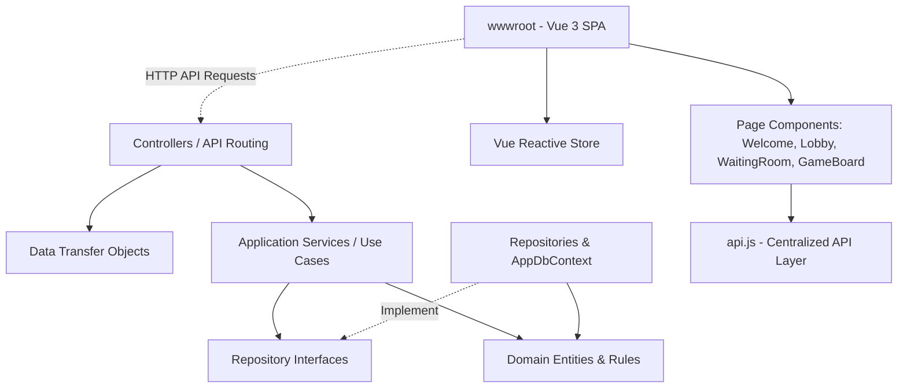

# CodeName Web App - System Documentation

Welcome to the development documentation for **CodeName Web App**, a full-stack, multiplayer word-guessing game inspired by the classic board game *Codenames*. This project features a clean, domain-driven .NET 9.0 API backend coupled with a Vue 3 reactive single-page application (SPA) frontend.

---

## 🛠️ Technology Stack

The project is built on the following technologies:
* **Backend Framework**: ASP.NET Core (.NET 9.0) Web API
* **Database & ORM**: SQLite database with Entity Framework Core (EF Core 9.0.0)
* **Frontend**: Vue 3 (CDN, no build tools) with HTML5 and CSS3 — reactive single-page application served statically
* **API Documentation**: Swagger/OpenAPI via Swashbuckle (`Swashbuckle.AspNetCore`)

---

## 🏗️ Architecture & Project Structure

The project follows a **Domain-Driven Design (DDD)**-inspired Clean Architecture to maintain a strict separation of concerns:

### Vue 3 Frontend Architecture

The frontend uses Vue 3 loaded via CDN (`unpkg.com`) — no npm, no build tools. The application is a single-page app driven by a reactive store (`Vue.reactive()`) that switches between four page components:

| Page Component | File | Purpose |
|---|---|---|
| WelcomePage | `wwwroot/js/components/WelcomePage.js` | Player name input & game rules |
| LobbyPage | `wwwroot/js/components/LobbyPage.js` | Create/join rooms, available rooms list, logout |
| WaitingRoomPage | `wwwroot/js/components/WaitingRoomPage.js` | Player list, start game, copy room code |
| GameBoardPage | `wwwroot/js/components/GameBoardPage.js` | Card grid, role modal, clue system, game over overlay |

**Key Files:**
- `wwwroot/js/store.js` — Vue reactive store (`store.player`, `store.room`, `store.myRole`, `store.page`), single source of truth
- `wwwroot/js/api.js` — Centralized API layer, all 12 backend endpoints wrapped as async methods
- `wwwroot/js/app.js` — Vue 3 app entry, registers components, drives routing via `store.page`
- `wwwroot/index.html` — Minimal shell, loads Vue CDN + component scripts, mounts `
`

**State Polling**: Pages poll `GET /api/rooms/{code}?playerId={playerId}` at different intervals:
- Lobby: 3 seconds (room list)
- Waiting Room: 2 seconds (player list, game start detection)
- Game Board: 2.5 seconds (cards, clues, roles, game over)

### 📂 Directory Walkthrough

* **`Domain/`**: The core of the application. Contains domain entities, aggregate roots, enums, and business logic. It has zero external dependencies other than core system libraries.
  * [Domain/GameRoom.cs](file:///c:/Users/alva/MindPalace/Programming/csharp_projects/web_app/WebAppSandbox/Domain/GameRoom.cs): The main aggregate root managing game rooms, game states, word shuffling, team assignments, win conditions, card reveals, and clues.
  * [Domain/Player.cs](file:///c:/Users/alva/MindPalace/Programming/csharp_projects/web_app/WebAppSandbox/Domain/Player.cs): Represents a player entity, their role in the room, and their current room association.
  * [Domain/CodeName.cs](file:///c:/Users/alva/MindPalace/Programming/csharp_projects/web_app/WebAppSandbox/Domain/CodeName.cs): Represents word lists or custom codenames configurations.
* **`Application/`**: Contains orchestration logic, interfaces, and specific use-case handlers.
  * `Interfaces/`: Repository interfaces declaring database operation contracts:
    * [IGameRoomRepository.cs](file:///c:/Users/alva/MindPalace/Programming/csharp_projects/web_app/WebAppSandbox/Application/Interfaces/IGameRoomRepository.cs)
    * [IPlayerRepository.cs](file:///c:/Users/alva/MindPalace/Programming/csharp_projects/web_app/WebAppSandbox/Application/Interfaces/IPlayerRepository.cs)
    * [ICodenameRepository.cs](file:///c:/Users/alva/MindPalace/Programming/csharp_projects/web_app/WebAppSandbox/Application/Interfaces/ICodenameRepository.cs)
  * `Services/`: Domain service orchestration corresponding to single responsibilities/use cases:
    * `StartGameService`: Loads board words from file (`words-id.txt` / project base directory), shuffles them, initializes cards/roles, and saves room state.
    * `JoinRoomService` & `LeaveRoomService`: Handle player entry and exit from game rooms.
    * `AssignRoleService`: Assigns players as Spymasters or Field Operatives.
    * `RevealCardService`: Handles card reveal guesses made by Field Operatives and checks win/loss outcomes.
    * `ClueService`: Handles adding and removing clues by the current Spymaster.
    * `CreatePlayerService`, `CreateRoomService`, `DeleteRoomService`, `GetAllPlayersService`.
* **`Infrastructure/`**: Data access and infrastructure implementations.
  * `Data/`: Contains the Entity Framework Core database context, [AppDbContext.cs](file:///c:/Users/alva/MindPalace/Programming/csharp_projects/web_app/WebAppSandbox/Infrastructure/Data/AppDbContext.cs), which maps the domain objects to SQLite database tables.
  * `Repositories/`: Implements repository interfaces, executing queries and saving domain state transitions back to the SQLite store (`CodenameRepository`, `GameRoomRepository`, `PlayerRepository`).
* **`DTO/`**: Data Transfer Objects defining standard schemas for incoming requests and outgoing responses (e.g., `RoomDetailResponse.cs`, `JoinRoomRequest.cs`, `AddClueRequest.cs`).
* **`Controller/`**: Web controllers handling routing, HTTP requests, parameter binding, and returning HTTP actions.
  * [PlayerController.cs](file:///c:/Users/alva/MindPalace/Programming/csharp_projects/web_app/WebAppSandbox/Controller/PlayerController.cs): Player sign-in and retrieval.
  * [GameRoomController.cs](file:///c:/Users/alva/MindPalace/Programming/csharp_projects/web_app/WebAppSandbox/Controller/GameRoomController.cs): Game lobby, room creation, joining, role setup, starting games, giving clues, and revealing cards.
  * [CodenameController.cs](file:///c:/Users/alva/MindPalace/Programming/csharp_projects/web_app/WebAppSandbox/Controller/CodenameController.cs): Fetching and creating custom codenames.
* **`wwwroot/`**: Static Vue 3 SPA assets (no build tools — Vue loaded via CDN):
  * [index.html](file:///c:/Users/alva/MindPalace/Programming/csharp_projects/web_app/WebAppSandbox/wwwroot/index.html): Minimal shell with `
` mount point and CDN script references.
  * [style.css](file:///c:/Users/alva/MindPalace/Programming/csharp_projects/web_app/WebAppSandbox/wwwroot/style.css): All component styling — layout, card colors, role badges, modals, spymaster hints, responsive design, and animations.
  * `js/store.js`: Vue 3 reactive store (`Vue.reactive()`) — single source of truth for player, room, role, and page state.
  * `js/api.js`: Centralized API layer wrapping all 12 backend endpoints.
  * `js/app.js`: Vue 3 app entry point, component registration, page routing via `<component :is>`.
  * `js/components/`: Four page components:
    * `WelcomePage.js` — Player name input and game rules
    * `LobbyPage.js` — Create/join rooms, available rooms list, logout
    * `WaitingRoomPage.js` — Player list, start game, copy room code
    * `GameBoardPage.js` — Card grid, role modal, clue system, game over overlay

---

## 💾 Database Schema

The SQLite database (`codename.db`) structure is managed via EF Core migrations:

1. **Players**: Represents players with fields:
   * `Id` (Guid, PK)
   * `Name` (String)
   * `GameRoomId` (Guid, FK nullable)
   * `GameRole` (Enum String: `None`, `Spymaster`, `FieldOperative`)
2. **GameRooms**: The lobby and active playing board tracker:
   * `Id` (Guid, PK)
   * `Code` (String)
   * `Status` (Enum String: `Empty`, `Waiting`, `Playing`, `Finished`)
   * `State_Phase` (Owned Entity, Enum String: `Empty`, `Lobby`, `SpymasterSelection`, `Playing`, `Ended`)
   * `State_Round` (Owned Entity, Int)
   * `State_IsStarted` (Owned Entity, Bool)
   * `State_Winner` (Owned Entity, String nullable)
3. **GameCards**: Individual word cards belonging to a `GameRoom`:
   * `Id` (Guid, PK)
   * `Word` (String)
   * `Role` (Enum String: `Assassin`, `RedAgent`, `BlueAgent`, `Bystander`)
   * `IsRevealed` (Bool)
   * `GameRoomId` (Guid, FK)
4. **Clues**: List of clues given by Spymasters in a `GameRoom`:
   * `Id` (Guid, PK)
   * `Word` (String)
   * `Count` (Int)
   * `GameRoomId` (Guid, FK, Cascade Delete)

---

## 🔌 API Endpoint Reference

### 👤 Players API (`/api/players`)
* **`POST /api/players`**: Creates a player and returns their unique `playerId`.
  * *Request Body*: `{ "Name": "PlayerName" }`
  * *Response*: `{ "id": "guid-here" }`
* **`GET /api/players`**: Lists all active players.

### 🏠 Game Rooms API (`/api/rooms`)
* **`POST /api/rooms`**: Creates a new game room and returns its unique random room code.
* **`GET /api/rooms`**: Gets a list of all active rooms (automatically cleans up empty rooms first).
* **`GET /api/rooms/{code}?playerId={playerId}`**: Retrieves full room detail, lists of players, cards, and clues.
  > [!NOTE]
  > If `playerId` belongs to a player with the **Spymaster** role, the cards list returns the exact underlying card roles (e.g., `RedAgent`, `BlueAgent`, `Assassin`). Otherwise, the roles remain hidden (`null`) unless they are already revealed.
* **`DELETE /api/rooms/{code}`**: Force deletes a room.
* **`POST /api/rooms/join`**: Adds a player to a room.
  * *Request Body*: `{ "Code": "ROOM_CODE", "PlayerId": "guid" }`
* **`POST /api/rooms/leave`**: Removes a player from their room.
  * *Request Body*: `{ "PlayerId": "guid" }`

### 🎮 Gameplay Actions (`/api/rooms/{code}/...`)
* **`POST /api/rooms/{code}/start`**: Starts the game. Shuffles 25 words from the list, distributes hidden card roles randomly (1 Assassin, 7 Bystanders, and Red/Blue agents depending on who starts), and assigns the starting team.
  * *Request Body*: `{ "PlayerId": "guid" }`
* **`POST /api/rooms/{code}/assign-spymaster`**: Sets the player's role to Spymaster (max 1 Spymaster per team/room configuration).
  * *Request Body*: `{ "PlayerId": "guid" }`
* **`POST /api/rooms/{code}/assign-field-operative`**: Sets the player's role to Field Operative.
  * *Request Body*: `{ "PlayerId": "guid" }`
* **`POST /api/rooms/{code}/reveal/{cardId}`**: Reveals a card. Can only be done by Field Operatives. If the Assassin is revealed, the game ends immediately. If all agents of a team are revealed, that team wins.
  * *Request Body*: `{ "PlayerId": "guid" }`
* **`POST /api/rooms/{code}/clue`**: Submits a clue. Only allowed for Spymasters.
  * *Request Body*: `{ "PlayerId": "guid", "Word": "CLUE", "Count": 3 }`
* **`DELETE /api/rooms/{code}/clue/{clueId}?playerId={playerId}`**: Deletes/retracts a clue.

---

## 🕹️ Gameplay Flow

1. **Onboarding**: A player registers their name. This name and player ID are saved in browser `localStorage`.
2. **Lobby**: The player can create a new room or join an existing one by code.
3. **Waiting Lobby**: Once inside, players wait until at least 2 players have joined. The player who initiates starts the game.
4. **Role Selection**: As the game starts, players choose to play as either a **Spymaster** (sees card colors and gives word clues) or a **Field Operative** (sees gray word cards, gets clues, and makes guesses).
5. **Playing**:
   * The Spymaster types a single-word clue and a count of related cards (e.g., `WATER 2`).
   * Field Operatives review the clue list and click cards to reveal them.
   * If a card matches their agent color, they continue. If it's a bystander or enemy agent, their turn changes (or they lose progress). If they reveal the Assassin (black card), they lose immediately.
6. **Game Over**: Once a team successfully reveals all of their color cards, or the Assassin is clicked, the game ends, a winner overlay is shown, and players can return to the lobby.
