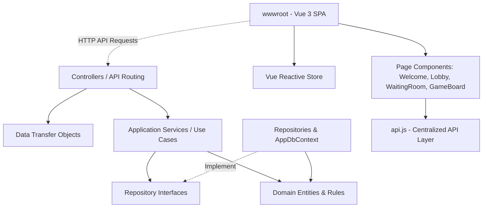

# CodeName Web App - System Documentation

Welcome to the development documentation for **CodeName Web App**, a full-stack, multiplayer word-guessing game inspired by the classic board game *Codenames*. This project features a clean, domain-driven .NET 9.0 API backend coupled with a Vue 3 reactive single-page application (SPA) frontend.

---

## 🛠️ Technology Stack

The project is built on the following technologies:
* **Backend Framework**: ASP.NET Core (.NET 9.0) Web API
* **Database & ORM**: SQLite database with Entity Framework Core (EF Core 9.0.0)
* **Frontend**: Vue 3 (CDN, no build tools) with HTML5 and CSS3 — reactive single-page application served statically
* **API Documentation**: Swagger/OpenAPI via Swashbuckle (`Swashbuckle.AspNetCore`)

---

## 🏗️ Architecture & Project Structure

The project follows a **Domain-Driven Design (DDD)**-inspired Clean Architecture to maintain a strict separation of concerns:



### Vue 3 Frontend Architecture

The frontend uses Vue 3 loaded via CDN (`unpkg.com`) — no npm, no build tools. The application is a single-page app driven by a reactive store (`Vue.reactive()`) that switches between four page components:

| Page Component | File | Purpose |
|---|---|---|
| WelcomePage | `wwwroot/js/components/WelcomePage.js` | Player name input & game rules |
| LobbyPage | `wwwroot/js/components/LobbyPage.js` | Create/join rooms, available rooms list, logout |
| WaitingRoomPage | `wwwroot/js/components/WaitingRoomPage.js` | Player list, start game, copy room code |
| GameBoardPage | `wwwroot/js/components/GameBoardPage.js` | Card grid, role modal, clue system, game over overlay |

**Key Files:**
- `wwwroot/js/store.js` — Vue reactive store (`store.player`, `store.room`, `store.myRole`, `store.page`), single source of truth
- `wwwroot/js/api.js` — Centralized API layer, all backend endpoints wrapped as async methods
- `wwwroot/js/app.js` — Vue 3 app entry, registers components, drives routing via `store.page`
- `wwwroot/index.html` — Minimal shell, loads Vue CDN + component scripts, mounts `<div id="app">`

**State Polling**: Pages poll `GET /api/rooms/{code}?playerId={playerId}&token={token}` at different intervals:
- Lobby: 3 seconds (room list)
- Waiting Room: 2 seconds (player list, game start detection)
- Game Board: 2.5 seconds (cards, clues, roles, game over)

### 📂 Directory Walkthrough

* **`Domain/`**: The core of the application. Contains domain entities, aggregate roots, enums, and business logic. It has zero external dependencies other than core system libraries.
  * [Domain/GameRoom.cs](file:///c:/Users/alva/MindPalace/Programming/csharp_projects/web_app/WebAppSandbox/Domain/GameRoom.cs): The main aggregate root managing game rooms, game states, word shuffling, team assignments, win conditions, card reveals, and clues.
  * [Domain/Player.cs](file:///c:/Users/alva/MindPalace/Programming/csharp_projects/web_app/WebAppSandbox/Domain/Player.cs): Represents a player entity, their role in the room, and their current room association.
  * [Domain/CodeName.cs](file:///c:/Users/alva/MindPalace/Programming/csharp_projects/web_app/WebAppSandbox/Domain/CodeName.cs): Represents word lists or custom codenames configurations.
* **`Application/`**: Contains orchestration logic, interfaces, and specific use-case handlers.
  * `Interfaces/`: Repository interfaces declaring database operation contracts:
    * [IGameRoomRepository.cs](file:///c:/Users/alva/MindPalace/Programming/csharp_projects/web_app/WebAppSandbox/Application/Interfaces/IGameRoomRepository.cs)
    * [IPlayerRepository.cs](file:///c:/Users/alva/MindPalace/Programming/csharp_projects/web_app/WebAppSandbox/Application/Interfaces/IPlayerRepository.cs)
    * [ICodenameRepository.cs](file:///c:/Users/alva/MindPalace/Programming/csharp_projects/web_app/WebAppSandbox/Application/Interfaces/ICodenameRepository.cs)
  * `Services/`: Domain service orchestration corresponding to single responsibilities/use cases:
    * `StartGameService`: Loads board words from file (`words-id.txt` / project base directory), shuffles them, initializes cards/roles, and saves room state.
    * `JoinRoomService` & `LeaveRoomService`: Handle player entry and exit from game rooms.
    * `AssignRoleService`: Assigns players as Spymasters or Field Operatives (per team: Red/Blue).
    * `RevealCardService`: Handles card reveal guesses made by Field Operatives and checks win/loss outcomes.
    * `ClueService`: Handles adding and removing clues by the current Spymaster.
    * `CreatePlayerService`, `CreateRoomService`, `DeleteRoomService`, `GetAllPlayersService`, `GetOnlineStatsService`.
* **`Infrastructure/`**: Data access and infrastructure implementations.
  * `Data/`: Contains the Entity Framework Core database context, [AppDbContext.cs](file:///c:/Users/alva/MindPalace/Programming/csharp_projects/web_app/WebAppSandbox/Infrastructure/Data/AppDbContext.cs), which maps the domain objects to SQLite database tables.
  * `Repositories/`: Implements repository interfaces, executing queries and saving domain state transitions back to the SQLite store (`CodenameRepository`, `GameRoomRepository`, `PlayerRepository`).
* **`DTO/`**: Data Transfer Objects defining standard schemas for incoming requests and outgoing responses (e.g., `RoomDetailResponse.cs`, `JoinRoomRequest.cs`, `AddClueRequest.cs`).
* **`Controller/`**: Web controllers handling routing, HTTP requests, parameter binding, and returning HTTP actions.
  * [PlayerController.cs](file:///c:/Users/alva/MindPalace/Programming/csharp_projects/web_app/WebAppSandbox/Controller/PlayerController.cs): Player sign-in and retrieval.
  * [GameRoomController.cs](file:///c:/Users/alva/MindPalace/Programming/csharp_projects/web_app/WebAppSandbox/Controller/GameRoomController.cs): Game lobby, room creation, joining, role setup, starting games, giving clues, and revealing cards.
  * [CodenameController.cs](file:///c:/Users/alva/MindPalace/Programming/csharp_projects/web_app/WebAppSandbox/Controller/CodenameController.cs): Fetching and creating custom codenames.
* **`wwwroot/`**: Static Vue 3 SPA assets (no build tools — Vue loaded via CDN):
  * [index.html](file:///c:/Users/alva/MindPalace/Programming/csharp_projects/web_app/WebAppSandbox/wwwroot/index.html): Minimal shell with `<div id="app">` mount point and CDN script references.
  * [style.css](file:///c:/Users/alva/MindPalace/Programming/csharp_projects/web_app/WebAppSandbox/wwwroot/style.css): All component styling — layout, card colors, role badges, modals, spymaster hints, responsive design, and animations.
  * `js/store.js`: Vue 3 reactive store (`Vue.reactive()`) — single source of truth for player, room, role, and page state.
  * `js/api.js`: Centralized API layer wrapping all backend endpoints.
  * `js/app.js`: Vue 3 app entry point, component registration, page routing via `<component :is>`.
  * `js/components/`: Four page components:
    * `WelcomePage.js` — Player name input and game rules
    * `LobbyPage.js` — Create/join rooms, available rooms list, logout
    * `WaitingRoomPage.js` — Player list, start game, copy room code
    * `GameBoardPage.js` — Card grid, role modal, clue system, game over overlay

---

## 💾 Database Schema

The SQLite database (`codename.db`) structure is managed via EF Core migrations:

1. **Players**: Represents players with fields:
   * `Id` (Guid, PK)
   * `Name` (String)
   * `GameRoomId` (Guid, FK nullable)
   * `GameRole` (Enum String: `None`, `Spymaster`, `FieldOperative`)
   * `Token` (String) — bearer token for authenticating state-mutating requests
2. **GameRooms**: The lobby and active playing board tracker:
   * `Id` (Guid, PK)
   * `Code` (String)
   * `Status` (Enum String: `Empty`, `Waiting`, `Playing`, `Finished`)
   * `State_Phase` (Owned Entity, Enum String: `Empty`, `Lobby`, `SpymasterSelection`, `Playing`, `Ended`)
   * `State_Round` (Owned Entity, Int)
   * `State_IsStarted` (Owned Entity, Bool)
   * `State_Winner` (Owned Entity, String nullable)
3. **GameCards**: Individual word cards belonging to a `GameRoom`:
   * `Id` (Guid, PK)
   * `Word` (String)
   * `Role` (Enum String: `Assassin`, `RedAgent`, `BlueAgent`, `Bystander`)
   * `IsRevealed` (Bool)
   * `GameRoomId` (Guid, FK)
4. **Clues**: List of clues given by Spymasters in a `GameRoom`:
   * `Id` (Guid, PK)
   * `Word` (String)
   * `Count` (Int)
   * `Team` (String) — which team the clue is for: `Red` or `Blue`
   * `GameRoomId` (Guid, FK, Cascade Delete)
5. **ActionLogs**: Audit trail of gameplay actions in a `GameRoom`:
   * `Id` (Guid, PK)
   * `Action` (String) — description of the action (e.g., "card revealed", "clue added")
   * `Timestamp` (DateTime)
   * `GameRoomId` (Guid, FK)

---

## ⚠️ Important Warnings & Best Practices

### 🔐 Token Authentication
Every **state-mutating** request (POST/PUT/DELETE) **wajib** menyertakan field `token` di request body. Token ini didapat dari response `POST /api/players` saat pertama kali player dibuat. Tanpa token yang valid, request akan ditolak dengan `401 Unauthorized`.

> [!CAUTION]
> Token disimpan di browser `localStorage`. Jika token hilang (e.g., user clear cache), player tidak bisa melanjutkan sesi dan harus register ulang.

### 🛡️ CSRF Protection
Semua request POST/DELETE **wajib** menyertakan header `X-CSRF-TOKEN` yang nilainya diambil dari cookie `CSRF-TOKEN`. Cookie ini di-set otomatis oleh server.

### ⏱️ Rate Limiting
Semua endpoint dilindungi **rate limiting** dengan policy `fixed`. Jangan melakukan polling terlalu agresif — gunakan interval yang direkomendasikan (2–3 detik antar page).

### 👁️ Spymaster Card Visibility
`GET /api/rooms/{code}` mengembalikan data kartu yang berbeda tergantung role player:
- **Spymaster**: Melihat semua `role` kartu (`RedAgent`, `BlueAgent`, `Assassin`, `Bystander`)
- **Field Operative**: Hanya melihat `role` kartu yang sudah `isRevealed: true`, sisanya `null`

> [!WARNING]
> Frontend **tidak boleh** mengekspos atau me-log data role kartu tersembunyi ke console/browser. Data ini sensitif — hanya Spymaster yang boleh melihatnya.

### 💾 LocalStorage
`playerId` dan `token` disimpan di `localStorage` browser dengan key:
- `codename_playerId`
- `codename_token`

Jika salah satu hilang, player harus register ulang lewat WelcomePage.

---

## 🔌 API Endpoint Reference

### 👤 Players API (`/api/players`)

**`POST /api/players`** — Register player baru
* *Request Body*: `{ "name": "PlayerName" }`
* *Response*: `{ "id": "guid-here", "token": "bearer-token-here" }`

**`GET /api/players`** — List semua player yang terdaftar
* *Response*: Array of `{ "id": "...", "name": "...", "gameRoomId": "..." | null }`

---

### 🏠 Game Rooms API (`/api/rooms`)

**`POST /api/rooms`** — Buat room baru
* *Response*: `{ "code": "ABCD" }`

**`GET /api/rooms`** — List semua room aktif (auto-cleanup empty rooms)
* *Response*: Array of room summary objects

**`GET /api/rooms/stats`** — Statistik online
* *Response*: `{ "totalOnline": 5, "inLobby": 3, "playing": 2, "totalRooms": 3 }`

**`GET /api/rooms/{code}?playerId={playerId}&token={token}`** — Detail room (cards, players, clues)
* *Query Params*:
  * `playerId` (Guid, optional) — ID player yang request
  * `token` (string, optional) — token player untuk autentikasi
* *Card Visibility*: Spymaster melihat semua role; Field Operative hanya melihat role kartu yang sudah revealed

> [!NOTE]
> Jika `playerId` milik **Spymaster**, kartu akan menyertakan role aslinya (`RedAgent`, `BlueAgent`, `Assassin`). Jika Field Operative, role disembunyikan (`null`) kecuali sudah revealed.

**`DELETE /api/rooms/{code}`** — Hapus room secara paksa

**`POST /api/rooms/join`** — Gabung ke room
* *Request Body*: `{ "code": "ABCD", "playerId": "guid-here", "token": "bearer-token" }`

**`POST /api/rooms/leave`** — Keluar dari room
* *Request Body*: `{ "playerId": "guid-here", "token": "bearer-token" }`

---

### 🎮 Role Assignment (`/api/rooms/{code}/...`)

> [!NOTE]
> Endpoint `assign-spymaster` dan `assign-field-operative` adalah **legacy** — secara default assign ke **Red team**. Gunakan endpoint team-specific untuk kontrol penuh.

**`POST /api/rooms/{code}/assign-spymaster`** ⚠️ Legacy — Assign ke Red Spymaster
* *Request Body*: `{ "playerId": "guid", "token": "bearer-token" }`

**`POST /api/rooms/{code}/assign-field-operative`** ⚠️ Legacy — Assign ke Red Field Operative
* *Request Body*: `{ "playerId": "guid", "token": "bearer-token" }`

**`POST /api/rooms/{code}/assign-red-spymaster`** 🔴 Assign ke Red Spymaster
* *Request Body*: `{ "playerId": "guid", "token": "bearer-token" }`

**`POST /api/rooms/{code}/assign-blue-spymaster`** 🔵 Assign ke Blue Spymaster
* *Request Body*: `{ "playerId": "guid", "token": "bearer-token" }`

**`POST /api/rooms/{code}/assign-red-operative`** 🔴 Assign ke Red Field Operative
* *Request Body*: `{ "playerId": "guid", "token": "bearer-token" }`

**`POST /api/rooms/{code}/assign-blue-operative`** 🔵 Assign ke Blue Field Operative
* *Request Body*: `{ "playerId": "guid", "token": "bearer-token" }`

---

### 🎮 Gameplay Actions (`/api/rooms/{code}/...`)

**`POST /api/rooms/{code}/start`** — Mulai game (shuffle 25 kata, distribusi role kartu)
* *Request Body*: `{ "playerId": "guid", "token": "bearer-token" }`

**`POST /api/rooms/{code}/reveal/{cardId}`** — Reveal kartu (Field Operative only)
* *Request Body*: `{ "playerId": "guid", "token": "bearer-token" }`

**`POST /api/rooms/{code}/clue`** — Beri clue (Spymaster only)
* *Request Body*: `{ "playerId": "guid", "word": "CLUE", "count": 3, "token": "bearer-token" }`

**`DELETE /api/rooms/{code}/clue/{clueId}?playerId={playerId}&token={token}`** — Hapus/retract clue (Spymaster only)

---

### 📚 Codenames API (`/api/codenames`)

**`POST /api/codenames`** — Buat codename/word list baru
* *Request Body*: `{ "name": "MyWordList", "description": "Custom word list" }`
* *Response*: `{ "id": "guid-here" }`

**`GET /api/codenames/{id}`** — Ambil codename/word list berdasarkan ID
* *Response*: `{ "id": "guid", "name": "...", "description": "..." }`

---

## 🗑️ Clear / Reset Database

Untuk menghapus **semua data** (players, rooms, cards, clues, action logs) dan mengembalikan database ke keadaan kosong:

### Metode 1: Hapus File DB & Rebuild (Rekomendasi)

Jalankan dua perintah berikut dari **project root** (folder yang berisi `codename.db`):

```powershell
del codename.db
dotnet ef database update
```

Perintah pertama menghapus file database SQLite sepenuhnya. Perintah kedua menjalankan ulang semua migration EF Core untuk membuat ulang database dengan struktur tabel yang bersih (kosong).

> [!WARNING]
> **Semua data akan hilang permanen.** Tidak bisa di-recover. Pastikan tidak ada data penting sebelum menjalankan perintah ini.

---

## 🕹️ Gameplay Flow

1. **Onboarding**: A player registers their name. This name, player ID, and token are saved in browser `localStorage`.
2. **Lobby**: The player can create a new room or join an existing one by code.
3. **Waiting Lobby**: Once inside, players wait until at least 2 players have joined. Each player picks a team role (Red/Blue Spymaster or Red/Blue Field Operative).
4. **Role Selection**: Players choose:
   * 🔴 **Red Spymaster** — sees card colors, gives word clues for Red team
   * 🔵 **Blue Spymaster** — sees card colors, gives word clues for Blue team
   * 🔴 **Red Field Operative** — sees gray word cards, gets clues, makes guesses for Red team
   * 🔵 **Blue Field Operative** — sees gray word cards, gets clues, makes guesses for Blue team
5. **Playing**:
   * The Spymaster types a single-word clue and a count of related cards (e.g., `WATER 2`).
   * Field Operatives review the clue list and click cards to reveal them.
   * If a card matches their agent color, they continue. If it's a bystander or enemy agent, their turn ends. If they reveal the Assassin (black card), their team loses immediately.
6. **Game Over**: Once a team successfully reveals all of their color cards, or the Assassin is clicked, the game ends, a winner overlay is shown, and players can return to the lobby.