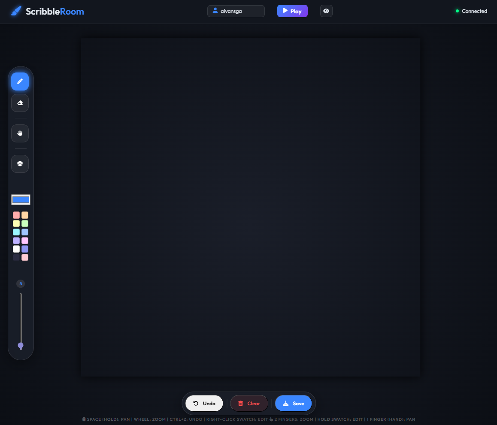
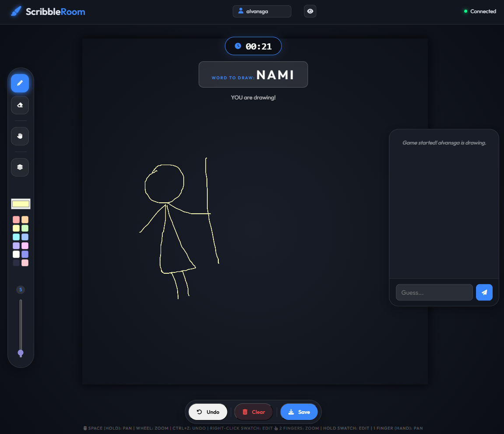

# Scribble Room App

Drawing together with your friends online! You can create your own server with ASP.NET and hosting it with ngrok.

---



---

# How to operate

### Left side panel
1. Open the Scribble Room web app 
2. Pencil tool to draw
3. Eraser tool to erase
4. Hand tool to move canvas
4. Pick image as background
5. Slide transparency of background
6. Pick color of pencil tool, right click to custom color
7. Slide to resize pencil or eraser tool

### Top side panel
1. State your name to guess
2. Play button to generate random word, and other can guess
3. Hide Side Panel
4. Connected hosting server status




### Bottom side panel
1. Undo last stroke from any clients
2. Clear canvas for everyone
3. Save current canvas into 2500x2500 image

---

# How to run 

Open the terminal and run 
```
dotnet run
```

Setup your ngrok account,  get your token and your.domain.app
```
ngrok http --urls=your.domain.app 5253
```

or

```
ngrok start webapp 
```

** make sure routing "webapp" in ngrok.yml file has been added!
